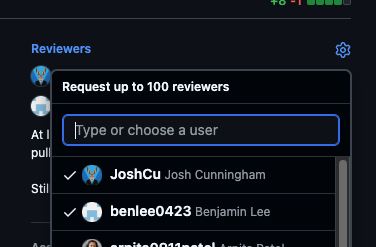
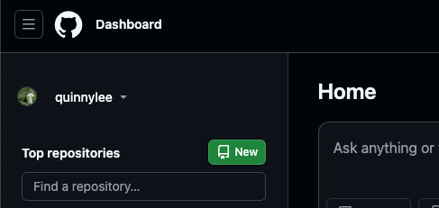
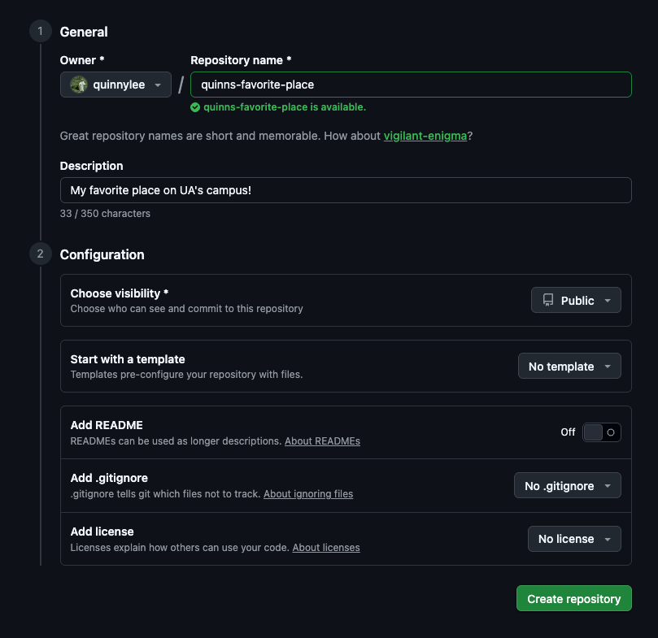

# Exercises

## Exercise 1: Setup

1. Make an account on [GitHub](https://github.com/).
2. Download git using the [official Git installation guide](https://git-scm.com/install/).
3. Open your terminal.
4. Set up your local machine with the name and email that you want to appear on every commit.

    ```bash
    git config --global user.name "Your Name"
    git config --global user.email "your_email@example.com"
    ```

5. Create a Secure Shell (SSH) key. This helps GitHub authenticate your commits.

    ```bash
    ssh-keygen -t ed25519 -c "your_email@example.com"
    ```

    When prompted to "Enter a file in which to save the key," you can press Enter to accept the default. (You could pick a different location, but I find that I can only remember the default location).
6. Print out the contents of the public key and copy it.

    ```bash
    cat /path/to/public/key
    ```

    The path to the public key, if you saved it in the default, is probably something like `/Users/username/.ssh/id_ed25519.pub` or `/home/username/.ssh/id_ed25519.pub`.
7. Add the SSH key to your GitHub account using the [official GitHub instructions](https://docs.github.com/en/authentication/connecting-to-github-with-ssh/adding-a-new-ssh-key-to-your-github-account).

Setup is complete! You are ready to start contributing.

## Exercise 2: Getting ready to contribute to someone else's repo

Forking a repository is useful when you want to make edits to a repository that you do not have write permissions for. We will be doing exercises out of my [git_practice repository](https://github.com/AlabamaWaterInstitute/git_practice) today, and you do not have write permissions to this repository. To get around this, you will fork my repo, which means making a copy of it that belongs to you. You can make changes to your fork of the repository (known as an *origin remote*).

(A remote is just a repo that lives on GitHub).

1. Open the repository in your browser window. Fork the repository by clicking on the "Fork" button.

   

2. In your terminal, navigate to the directory where you would like to keep your workshop materials.

   ```bash
   cd /path/to/directory
   ```

3. Clone your exercise repository.

    ```bash
    git clone (git@github.com:YourUsername/git_practice.git)
    ```

    To easily find this URL, click on the green "<> Code" button, and select SSH.

    

4. Add an *upstream remote*. An upstream remote is the official repo on GitHub that you would like to make changes to. In this case, the upstream is my repository.

    ```bash
    git remote add upstream https://github.com/AlabamaWaterInstitute/git_practice.git
    ```

     To easily find this URL, click on the green "<> Code" button, and select SSH.

    

    Notice that for your `origin` remote, we clone with the SSH URL. This is because GitHub requires you to use SSH to authenticate whenever you push commits to the remote repo. Because you can't directly contribute to the `upstream` remote, we can just clone with the HTTPS URL.

5. Let's see our remotes.

    ```bash
    git remote -v
    ```

    Here, the `-v` flag means "verbose," because we want to see the details of our remotes. Our remotes are named `origin` and `upstream`, which are just common naming conventions. They could be named whatever you want, but we will stick with `origin` and `upstream` for this workshop.

## Exercise 3: Your first contribution

In `exercise_files/roster.txt`, we will keep a list of the names of everyone who attended this workshop. Let's add your name to the list.

It's good practice to do your development work in a local development branch so that it doesn't change the `main` branch.

1. Create a new development branch from the most recent copy of the upstream remote.

   ```bash
   git fetch upstream
   git checkout upstream/main
   git checkout -b roster
   ```

   `git fetch upstream` updates your local copy of upstream. `git checkout upstream/main` creates a "detached HEAD," which is a fancy way of saying that you are just checking out a specific commit, and not a branch. We are checking out a commit from upstream because we want the most recent version of the repo, since there will be lots of contributors to this repo. "Checking out" is the git way of making a branch visible in your working directory. `git checkout -b roster` creates a new local branch called `roster` and also checks out the branch.

2. Open up `exercise_files/roster.txt` and add your name to the list. Make sure to save!
3. Did Git notice your local changes?

   ```bash
   git status
   ```

   This will show you the "changes not staged for commit.
4. Stage your change.

   ```bash
   git add .
   ```

5. Commit your change. Give the commit message a short description of the change you made.

    ```bash
    git commit -m "my message here"
    ```

    Good commit messages are short. Longer descriptions of the changes you made can be done in a pull request.

6. Push your local change up to your origin remote.

    ```bash
    git push origin roster
    ```

    This command creates a branch called `roster` in your origin remote.

7. Open your first pull request (often referred to as a PR). Navigate to the [upstream remote's GitHub page](https://github.com/AlabamaWaterInstitute/git_practice). There will probably be a highlighted button saying that there were changes to a fork and prompting you to open a pull request. In the PR, you can explain the changes you made and the reasoning behind it. Once a maintainer of the repository accepts your PR, your changes will be merged with the upstream remote!

**Note:** We usually don't have ~10 people working on the same repository at the same time. This puts us at risk of a *merge conflict*, where the changes you are trying to contribute conflict with what is in the upstream `main` branch. If this happens, the GitHub will not let your PR be merged. There should be a button on the GitHub PR page that will walk you through how to resolve a merge conflict.

## Exercise 4: The add/commit cycle, ad nauseam

To build your muscle memory, we will repeatedly make a change, stage the change with `git add`, and commit the change to your local branch with `git commit`. This may seem tedious, but it makes up a whole lot of the Git workflow. We will be editing `exercise_files/favorite_things.md`. For help with Markdown syntax, take a look at this [cheat sheet](https://www.markdownguide.org/cheat-sheet/).

1. Update your local copies of `upstream` and `origin`, as well as your `origin remote`.

    ```bash
    git checkout main # check out your local main branch
    git pull --rebase upstream main # fetch the upstream remote, merge any changes in upstream into your local main branch
    git push # push any changes in your local main branch up to your origin remote
    ```

    This is good practice before you make any changes so that you know you're working off the most recent codebase.
2. Create a new development branch.

    ```bash
    git fetch upstream
    git checkout upstream/main
    git checkout -b favorite-things
    ```

3. For each favorite thing, make a change to the markdown file, stage it with `git add`, and commit the change with `git commit -m "your message"`. By the end of this, you should have 10 commits.
4. Push your local changes to your origin remote.

   ```bash
   git push origin favorite-things
   ```

5. Open a pull request in the upstream remote.

## Exercise 5: Add a new file

We will add a file about you into the `exercise_files/about_mes` directory. You can copy the example already in the directory.

1. Update your local copies of `upstream` and `origin`, as well as your `origin remote`.
2. Create a new development branch.
3. Create a `.txt` file named `your_name.txt`. Fill the file with some basic information about yourself.
4. Check `git status` to see what it looks like to add an "untracked file" (a file that Git has never seen before).
5. Stage your file.
6. Commit your file.
7. Push your local change to your origin remote.
8. Open a pull request in the upstream remote.

## Exercise 6: Viewing another contributor's changes

Notice all the changes that show up in the roster, favorite things document, and about me directory when you update your local repositories with the changes from upstream. We will look at those changes and make comments on our colleagues' favorite things.

1. Update your local copies of `upstream` and `origin`, as well as your `origin remote`.
2. Create a new development branch.
3. Open up `exercise_files/favorite_things.md`. Find two interesting favorite things to comment on and add those comments to the document. Examples: "Wow I like that too!" "That is a horrible opinion!" "My sister's dentist's son's girlfriend is really into this."
4. Stage your changes.
5. Commit your changes.
6. Push your local changes to your origin remote.
7. Open a pull request in the upstream remote.

## Exercise 7: Responding to PR reviews

Sometimes, a maintainer of a repo will review your PR and ask you for changes. In this exercise, we will populate a document with a research question about anything you are curious about, and you will respond to my "changes requested."

1. Update your local copies of `upstream` and `origin`, as well as your `origin remote`.
2. Create a new development branch.
3. Open up `exercise_files/research.md`. Add your research question to the list.
4. Stage your changes.
5. Commit your changes.
6. Push your local changes to your origin remote.
7. Open a pull request in the upstream remote.
8. Request a review from me (@quinnylee). Click on the gear icon in the top right by "Reviewers" and select my username. It will look something like this:

    

9. When you see my "changes requested," go back to your working directory and make the appropriate change.
10. Stage your changes.
11. Commit your changes.
12. Push your local changes to your origin remote.
13. Check back on the PR page in the upstream remote. You should see that any changes you made to the origin remote are reflected in the commit history here too.

## Exercise 8: Making your own repository

It's time for you to make your own repository. This repository will highlight your favorite place on your college's campus.

1. On the GitHub home page, click on the new repository button. It is a green button in the top left with a book icon.

    

2. Fill out the repository information. The owner is you, the repository name can be something like `my-favorite-place`, give it a short description, set visibility to public. Don't use a template, and don't add any of the files listed (README, .gitignore, license) for this exercise.

    
3. Click "Create repository".
4. Go to the location in your working directory where you want your local `my-favorite-place` repository to be located. Create a directory there.

   ```bash
   cd /path/to/dir
   mkdir my-favorite-place
   ```

5. On the GitHub website, there should be some instructions on how to create a new repository on the command line. Follow those instructions. You have created your repository!

## Exercise 9: Stashing changes

It's good practice to do all your development work in a specific development branch. What do you do if you realize you've been doing work in the `main` branch?

1. Edit the `README.md` in your favorite place repository. Add some facts about the place and why you like it.
2. You've just realized you've been editing in `main`! We can store those changes while you switch to another branch.

    ```bash
    git stash
    ```

3. Your changes have been tucked away for now. Create a development branch and check it out.
4. Pull your previous changes back from the stash.

    ```bash
    git stash pop
    ```

5. Stage your changes.
6. Commit your changes.

## Exercise 10: Amending commits

Sometimes, you will want to edit the contents of a commit. This is super easy when you haven't pushed your local commits up to the remote yet. Let's add a picture of the location to the repository.

1. Download a photo of the location and put it in your repository.
2. Stage your changes.
3. Edit your commit.

    ```bash
    git commit --amend
    ```


## Exercise 11: Reverting commits

## Exercise 12: Removing files

## Exercise 13: Merging someone else's changes

## Exercise 14: Opening an issue

## Exercise 15: Closing an issue via PR

## Exercise 16: .gitignore

## Exercise 17: Other useful files to keep in a repository

## Exercise 18: git log

## Exercise 19: git diff